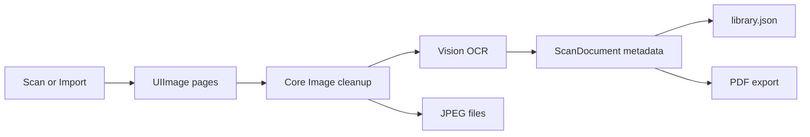

# SaneScan Architecture

## 1. Product Shape

SaneScan is an iOS scanner app for private photo and document capture. The app is local-first: it stores scan images, OCR text, and exported PDFs in the app container unless the user shares them.

## 2. Main Components

| Component | Path | Responsibility |
|---|---|---|
| App entry | `SaneScan/SaneScanApp.swift` | Root app wiring and shared objects |
| Library | `Core/Services/ScanLibrary.swift` | Local persistence, scan creation, image loading, PDF export |
| OCR | `Core/Services/OCRService.swift` | Vision text recognition |
| Image cleanup | `Core/Services/ImageEnhancementService.swift` | Local Core Image enhancement |
| PDF export | `Core/Services/PDFExportService.swift` | PDF rendering |
| Purchases | `Core/Services/PurchaseManager.swift` | StoreKit products and entitlement state |
| Scanner bridge | `iOS/Views/DocumentCameraView.swift` | VisionKit document camera wrapper |

## 3. Data Flow

## 4. Verified Research

## VisionKit Document Scanning | Updated: 2026-05-17 | Status: verified | TTL: 90d

Apple documents `VNDocumentCameraViewController` as the system UI for scanning physical documents. It returns scanned page images through `VNDocumentCameraScan`, and Apple describes exporting those scanned images to PDF as an intended use. SaneScan uses a fresh scanner instance for each scan and bridges it into SwiftUI through `UIViewControllerRepresentable`.

Source: Apple Developer Documentation, `VNDocumentCameraViewController`.

## Vision OCR | Updated: 2026-05-17 | Status: verified | TTL: 90d

Apple documents `VNRecognizeTextRequest` as the Vision request for finding and recognizing text in images. SaneScan uses accurate recognition, language correction, automatic language detection, and revision 3 on iOS 17+.

Source: Apple Developer Documentation, `VNRecognizeTextRequest`.

## Reused SaneApps Patterns | Updated: 2026-05-17 | Status: verified | TTL: 90d

SaneScan follows SaneClip's iOS target shape and OCR sorting approach, and SaneVideo's actor-style PDF/OCR service boundaries. The code is app-specific rather than copied wholesale because SaneClip is macOS screenshot OCR and SaneVideo is video-project export.

## 5. Privacy And Permissions

- `NSCameraUsageDescription`: camera access is tied to explicit scanning.
- `NSPhotoLibraryUsageDescription`: photo access is tied to explicit import.
- Privacy manifest declares no collected data and no tracking.

## 6. App Store State

- App Store Connect app ID: `6770391054`.
- Bundle ID: `com.sanescan.app` / Apple Developer ID `UT3A85VYT3`.
- iOS version `1.0` is submitted and reports `WAITING_FOR_REVIEW`; submission ID `aa25a650-7eb8-4b5f-9e71-a93ec3d856b8`.
- Build `100` is attached to the version.
- Annual subscription `com.sanescan.app.pro.annual` is created, priced, attached, and submitted with the version.
- App Privacy is published as `Data Not Collected`.
- Privacy policy URL: `https://sanescan-site.pages.dev/privacy`.

## 7. Follow-Up

- Add real-device VisionKit document camera proof when an iPhone connection is available.
- Fix SaneMaster's SaneScan/iOS-only test destination handling so App Store preflight uses an iOS simulator instead of a macOS install attempt.
