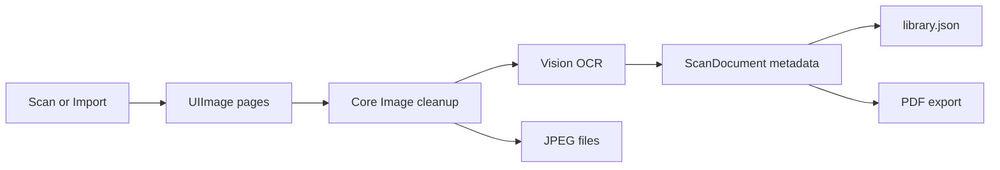

# SaneScan Architecture

## 1. Product Shape

SaneScan is an iOS scanner app for private photo and document capture. The app is local-first: it stores scan images, OCR text, and exported PDFs in the app container unless the user shares them.

## 2. Main Components

| Component | Path | Responsibility |
|---|---|---|
| App entry | `SaneScan/SaneScanApp.swift` | Root app wiring and shared objects |
| Library | `Core/Services/ScanLibrary.swift` | Local persistence, scan creation, image loading, PDF export |
| OCR | `Core/Services/OCRService.swift` | Vision text recognition |
| Image cleanup | `Core/Services/ImageEnhancementService.swift` | Local Core Image enhancement |
| PDF export | `Core/Services/PDFExportService.swift` | PDF rendering |
| Purchases | `Core/Services/PurchaseManager.swift` | StoreKit products and entitlement state |
| Scanner bridge | `iOS/Views/DocumentCameraView.swift` | VisionKit document camera wrapper |

## 3. Data Flow

## 4. Verified Research

## Product Quality Checklist Research | Updated: 2026-06-07 | Status: verified | TTL: 90d

SaneScan release proof now treats UI/UX, marketing, screenshot provenance, App
Store state, accessibility, monetization, recovery, performance, and funnel
telemetry as first-class customer-reality surfaces. The professional review
baseline combines Apple App Store product-page guidance, Apple HIG guidance for
feedback/onboarding/accessibility, and heuristic-evaluation practice. Durable
checklist questions live in `Tests/CustomerUIActions.yml` under
`product_quality_checklist`, and release receipts must answer every item through
`product_quality_review`.

Practical implications:

- App Store and website screenshots must show real app UI doing the promised
  work, not blank states, artificial composites, stale paywalls, or cropped
  helper-window captures.
- The first screenshot should communicate the main job-to-be-done; for
  SaneScan, the current local App Store asset order leads with the document
  detail/OCR/PDF proof instead of the empty library.
- Product-quality review items marked `failed` or `unknown` block release until
  the missing evidence is captured or the claim is removed.

Sources: Apple "Creating your product page", Apple App Store screenshot/app
preview guidance, Apple HIG Feedback/Onboarding/Accessibility, Nielsen Norman
Group usability heuristics.

## VisionKit Document Scanning | Updated: 2026-05-17 | Status: verified | TTL: 90d

Apple documents `VNDocumentCameraViewController` as the system UI for scanning physical documents. It returns scanned page images through `VNDocumentCameraScan`, and Apple describes exporting those scanned images to PDF as an intended use. SaneScan uses a fresh scanner instance for each scan and bridges it into SwiftUI through `UIViewControllerRepresentable`.

Source: Apple Developer Documentation, `VNDocumentCameraViewController`.

## Vision OCR | Updated: 2026-05-17 | Status: verified | TTL: 90d

Apple documents `VNRecognizeTextRequest` as the Vision request for finding and recognizing text in images. SaneScan uses accurate recognition, language correction, automatic language detection, and revision 3 on iOS 17+.

Source: Apple Developer Documentation, `VNRecognizeTextRequest`.

## Reused SaneApps Patterns | Updated: 2026-05-17 | Status: verified | TTL: 90d

SaneScan follows SaneClip's iOS target shape and OCR sorting approach, and SaneVideo's actor-style PDF/OCR service boundaries. The code is app-specific rather than copied wholesale because SaneClip is macOS screenshot OCR and SaneVideo is video-project export.

## 5. Privacy And Permissions

- `NSCameraUsageDescription`: camera access is tied to explicit scanning.
- `NSPhotoLibraryUsageDescription`: photo access is tied to explicit import.
- Privacy manifest declares no tracking. Public policy copy says SaneScan does
  not upload scan contents, OCR text, photos, documents, accounts, device IDs,
  or session IDs, and may send limited aggregate purchase-flow diagnostics.

## 6. App Store State

- App Store Connect app ID: `6770391054`.
- Bundle ID: `com.sanescan.app` / Apple Developer ID `UT3A85VYT3`.
- iOS version `1.0` reports `READY_FOR_SALE`; submission ID
  `528b035a-b097-445f-834b-257d4e059720`.
- The public US App Store URL returns HTTP 200 at
  `https://apps.apple.com/us/app/sanescan/id6770391054`.
- Annual subscription `com.sanescan.app.pro.yearly6` is the current yearly StoreKit product. It uses a replacement subscription group after Apple rejected earlier group/product localizations and ASC refused edits to rejected localizations.
- Local and public privacy policy copy has been updated for aggregate
  purchase-flow diagnostics; App Store Connect App Privacy metadata still needs
  review before the next editable submission if those diagnostics remain active.
- Privacy policy URL: `https://sanescan.saneapps.com/privacy/`.
- Current local screenshot assets are corrected, but Apple blocks modifying
  screenshots on the live `READY_FOR_SALE` 1.0 version. Public App Store
  screenshot changes require a new editable App Store version.

## 7. Follow-Up

- Add real-device VisionKit document camera proof when an iPhone connection is
  available.
- Prove the StoreKit transaction outcomes in an active Xcode StoreKit,
  sandbox/TestFlight, or attached-device environment. The local annual product
  catalog and paywall copy are verified, but Mini headless transaction proof is
  not reliable.
- Create a new editable App Store version before attempting to update public
  screenshots or submitting the next App Privacy metadata correction.
